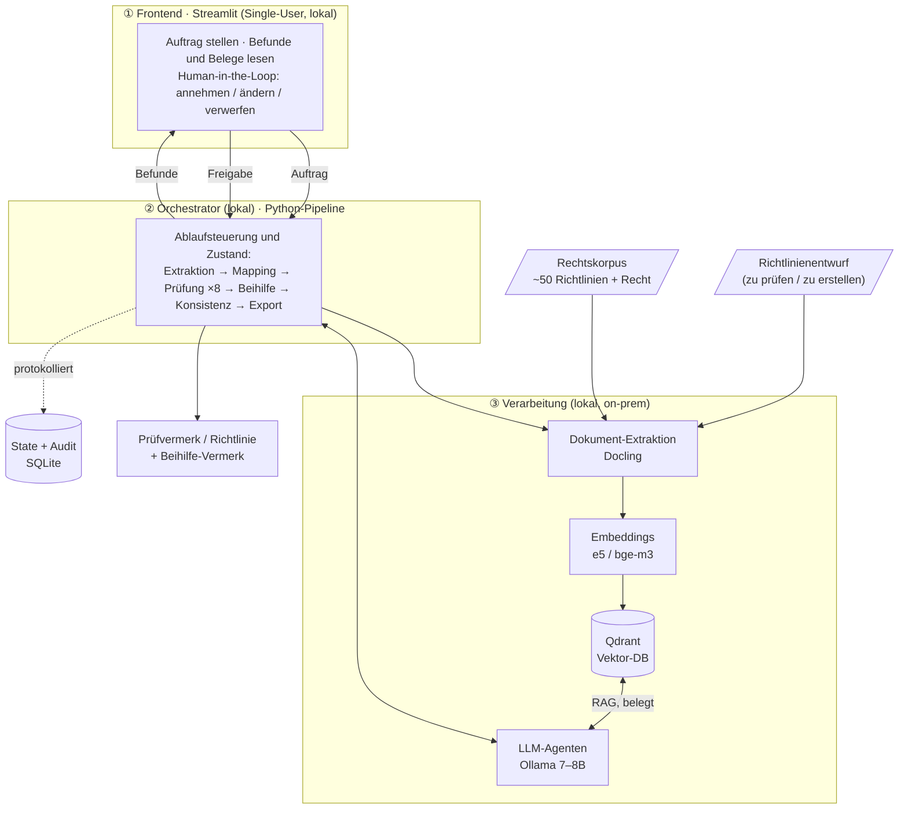

# Kickoff-Agenda — MLEUV KI-Tool

**03.07.2026 · in Person am HPI**

| # | Punkt | Ziel |
|---|---|---|
| 1 | Vorstellung der Phasen | gemeinsames Verständnis des Fahrplans |
| 2 | Infrastruktur der Pipeline | zeigen, welche Komponenten wofür vorgesehen sind |
| 3 | Pilot Project Agreement | offene Felder klären, Commitment |
| 4 | Was noch fehlt | Bereitstellung durch MLEUV |
| 5 | Offene Fragen | Klärung offener Fragen |

---

## 1. Vorstellung der Phasen

Erst ein kleiner, sicherer Case, dann in Phasen erweitern (Prüfung vor Erstellung).

→ direkt am [Meilensteinplan](../02_meilensteinplan/meilensteinplan.md) vorstellen.

---

## 2. Infrastruktur der Pipeline

Komplett **lokal / on-prem** — keine externen APIs, keine Cloud. Komponenten Spark-kompatibel gewählt.



| Pipeline-Schritt | Vorgesehene Infrastruktur | Warum |
|---|---|---|
| Dokument-Extraktion | **Docling** | Layout-/Tabellen-Verständnis, wie Spark; lokal lauffähig |
| Vektor-DB / RAG | **Qdrant lokal (Docker)** | wie Spark, on-prem, skalierbar; Chroma nur Fallback |
| Embeddings | **`multilingual-e5`** und **`bge-m3`** — im Eval vergleichen | beide deutschfähig; Wahl datenbasiert entscheiden |
| LLM-Agenten | **Ollama 7–8B** über OpenAI-kompatible API (localhost) | lokal, Spark-kompatibel, Modell/GPU später austauschbar |
| Zustand + Audit | SQLite (mit `actor`-Feld) | leichtgewichtig, spätere Auth vorbereitet |
| UI (Human-in-the-Loop) | Streamlit | schnell, Single-User |
| Orchestrierung | einfache Python-Pipeline | deterministisch, auditierbar; **Spark/Temporal erst ab Phase 5** (Multi-User/Produktion) |

**Kernbotschaft:** dieselben Bausteine wie Spark (Docling, Qdrant, OpenAI-kompatibler LLM, HITL, Audit), aber ohne die schwere Orchestrierung — alles lokal. → [Infrastrukturplan](../01_architektur/infrastrukturplan.md)

---

## 3. Pilot Project Agreement

[Pilot_Project_Agreement.md](Pilot_Project_Agreement.md) gemeinsam durchgehen — grün = meine Vorschläge, zu bestätigen. Noch zu klären:
- Partner-Anschrift (MLEUV), Namen/Funktionen der Unterzeichner
- Laufzeit 03.07.–30.09.2026, Meetings (wöchentlich Fr 12–13 Uhr), Nextcloud als Ablage
- IP/Veröffentlichung: Code open source, interne Dokumente (05/06/07) nicht veröffentlichen

---

## 4. Was noch fehlt

| Fehlt / offen | Beschreibung | Zuständig |
|---|---|---|
| **Validation-/Eval-Set** | größtes offenes Stück — Form/Template siehe unten | AISC + **MLEUV (Fehlerdaten)** |
| **Reale Fehlerdaten** | frühere Entwurfsfassungen + zugehörige Prüfvermerke/Korrekturen | **MLEUV** |
| **Zielhardware** | durchschnittl. Verwaltungs-PC unbekannt (Entwicklung auf Apple M4/16 GB) | MLEUV |
| **B3 Bauplan** | Musterrichtlinie (Anlage 04) → maschinenlesbar (`bauplan.yaml`) | AISC |
| **Metadaten + Gültigkeit** | Korpus taggen: Rechtsebene, Stand, welche Fassung aktuell | AISC |
| **Modellwahl** | 7–8B-LLM + 2 Embedding-Modelle testen und festlegen | AISC |
| **Prompts** | aus Konzeptdoc 12 ausformulieren, auf Prüf-Modus + Ausgabeschema umstellen | AISC |
| **Rechtsprechung/FAQ-Korpus** | in der Architektur vorgesehen, aber nicht im Datenbestand | MLEUV (falls vorhanden) |
| **Stufe-C-Fall (EU-Beihilfe)** — *optional / später* | Schwein (Stufe B) deckt Beihilfe schon ab; De-minimis-Pfad bei Bedarf synthetisch ergänzen | optional (AISC) |
| **Fachliche Validierung** | SB, der Prüf-Befunde gegenprüft | MLEUV |

### Form der Eval-Daten (Template)

Damit die Fehlerdaten direkt nutzbar sind, sollten sie pro Fall so strukturiert vorliegen (ein YAML/Tabellen-Eintrag je Fall):

```yaml
fall_id: KAT-001
quelle: mleuv-real | synthetisch | positiv     # Herkunft
stufe: A | B | C                                # A=Land, B=Bund+Land, C=+EU
basis_richtlinie: "RL Katzenkastration"
dokument: entwurf_kat_001.pdf                   # der zu prüfende Entwurf
fehler:                                         # leer bei quelle=positiv
  - abschnitt: 8                                # welcher der 8 §-44-Abschnitte
    art: fehlend | falsch | inkonsistent
    beschreibung: "Geltungsdauer nicht angegeben"
erwarteter_befund:                              # das Soll-Ergebnis (Gold)
  - abschnitt: 8
    typ: fehlt | abweichung | konform | unklar
    schweregrad: hoch | mittel | niedrig
    soll_fundstelle: "VV zu § 44 LHO, Nr. X"
```

**Konkret von MLEUV gewünscht (die einfachste nutzbare Form):**
- **Paare** aus *früherer Entwurfsfassung* (Datei) **+** *dazugehörigem Prüfvermerk/Korrektur* (was wurde bemängelt, an welcher Stelle, warum).
- Die Prüfvermerke müssen nicht im obigen Template vorliegen — das Überführen ins Template macht AISC. Wichtig ist nur, dass **Entwurf und Befund zusammengehören** und die bemängelte Stelle erkennbar ist.
- Falls keine realen Daten verfügbar: AISC erzeugt synthetische Fehlerfälle aus korrekten Richtlinien (etwas künstlicher).

→ Methodik/Split: [Datengrundlage](../03_datengrundlage/README.md)

---

## 5. Offene Fragen an MLEUV

1. Könnt ihr **frühere Entwurfsfassungen + Prüfvermerke** als reale Fehlerdaten bereitstellen? (für das Eval-Set)
2. Auf welchem **PC-Typ** soll das Tool am Ende laufen? (bestimmt die Modellgröße)
3. Gibt es einen **Rechtsprechungs-/FAQ-Bestand** (Gerichtsentscheidungen, Auslegungshinweise)? In der Architektur vorgesehen, aber nicht in den Daten — für tiefere juristische Begründung bei Grenzfällen.
4. **Wie stellt ihr euch eine Zusammenarbeit vor?**


TODO:
- Zugriff HPC cluster nachfragen
- UI template zur Erstellung, gerade word, --> guided Ausfüllen -> phase 1 weg


- Beihilfe muss immer geprüft werden
- Spark workflow auf node beihilfe fit?
- kleinstes llm für funktionalität
- test datensatz für Eingabe in das Template
- Baustein Dokument matching

- Jill schickt Projekt agreement in nextcloud
- Jill schreibt Protokoll und legt es in die nextcloud
- Urlaub Info übergeben
- systemisch wann beihilfen chek sinnvoll, während der erstellung oder erst checkk nach ersten draft
- Datenmodell überlegen