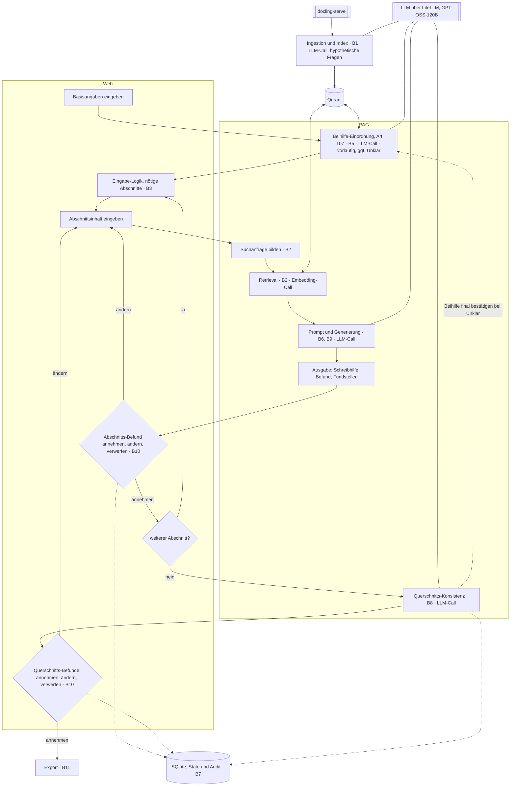

# Architektur

> Status: aktueller Stand 2026-07-10. Fokus geführte Erstellung, Prüfen zweitrangig.

## Ablauf, von der Eingabe bis zum Output

*LLM-Calls an drei Stellen: hypothetische Fragen bei der Ingestion B1, Generierung und Prüfung B6, Querschnitts-Konsistenz B8. Embeddings laufen über denselben LiteLLM-Endpoint, bei der Ingestion und bei der Suchanfrage.*

*Prüf-Modus: gleicher Ablauf, aber statt der Eingabe ein Upload, davor B4 Vollständigkeit gegen die Musterstruktur, Ergebnis ist ein Prüfvermerk.*

## Bausteine

| Baustein | Rolle | Wo im Ablauf | Aus Spark? |
|---|---|---|---|
| B1 Ingestion | Datei zu Text, Chunks, Index | vorab, Phase 0 | ja, modul-inhaltsextraktion |
| B2 RAG | Suchanfrage und Retrieval der gültigen Rechtsstelle | Suchanfrage und Retrieval | ja, modul-suche-und-zuordnung |
| B3 Baustein-Modell | Musterstruktur, Pflicht-Regeln und Abschnitts-Abhängigkeiten | steuert die dynamische Eingabe-Logik | nein, eigen |
| B4 Mapping | Zuordnung zu den 8 Abschnitten | nur Prüf-Modus, Vollständigkeit | nein, eigen |
| B5 Beihilfe | Einordnung nach Art. 107 | eigener Schritt, früh vor den Abschnitten | nein, eigen |
| B6 Abschnitts-Worker | schreibt oder prüft einen Abschnitt | Prompt und Generierung | Prompt eigen, LLM-Call-Muster von Spark |
| B7 State-Manager | Fallzustand und Audit-Log, actor-Feld | durchgehend | nein, eigen, leicht |
| B8 Konsistenz | Widersprüche zwischen Abschnitten | Querschnitts-Konsistenz | nein, eigen |
| B9 Governance | Quellenpflicht, Normenhierarchie | durchgehend im Prompt | Prinzip von Spark |
| B10 Human-in-the-Loop | Mensch entscheidet | annehmen, ändern, verwerfen | Partner |
| B11 Export | Richtlinie bzw. Prüfvermerk | Export | nein, eigen |

*Nur B6 wird zwischen Erstellen und Prüfen umgeschaltet. Der Beihilfe-Teil ist bedingt, gesteuert über die Pflicht-Regel in B3. Vollständigkeit hat zwei Ebenen: fehlt ein ganzer Abschnitt, meldet es B4, nur im Prüf-Modus; fehlt ein Pflichtelement innerhalb eines Abschnitts, meldet es die Abschnitts-Prüfung B6 gegen die B3-Elemente.*

### Abschnitts-Abhängigkeiten (B3)

Abschnitte hängen voneinander ab: Eine Eingabe in Abschnitt 1 kann bewirken, dass Abschnitt 7 zur Pflicht wird. Deshalb hat B3 pro Abschnitt statt eines festen Flags eine **Pflicht-Regel** — `ja` / `nein` / `bedingt`, wobei `bedingt` eine `bedingung` trägt, die auf Basisangaben und auf Antworten anderer Abschnitte verweisen darf (z. B. `abschnitt_7.pflicht = abschnitt_1.foerderart == 'X'`).

Folge für den Ablauf: Die Eingabe-Logik läuft **nicht einmalig**, sondern rechnet die Menge der nötigen Abschnitte nach jeder angenommenen Eingabe neu (im Diagramm: `weiterer Abschnitt?` führt zurück auf B, nicht direkt auf die Eingabe). Die Abhängigkeiten bilden einen gerichteten azyklischen Graphen — der bedingende Abschnitt muss vor dem bedingten liegen, Zyklen sind verboten. B7 protokolliert, welche Regel einen Abschnitt zur Pflicht gemacht hat. Diese Logik baut der Partner (MLEUV); RAG/B6 bleiben unberührt.

**Re-Prüfung bei Änderung:** Wird ein bereits ausgefülltes Feld nachträglich geändert, sind alle davon abhängigen Ergebnisse veraltet und müssen neu geprüft werden — entlang derselben Abhängigkeitskanten: der geänderte Abschnitt selbst (B6-Plausibilität), jeder Abschnitt, dessen Pflicht-Regel auf das geänderte Feld zeigt (kann neu Pflicht werden oder entfallen), und die Querschnitts-Konsistenz B8. Ändert sich eine Basisangabe, kann zusätzlich die Beihilfe-Einordnung B5 neu laufen. B7 markiert die betroffenen Befunde als *stale*; die erneute Prüfung wird gebündelt beim nächsten Nutzer-Trigger ausgelöst, nicht bei jeder Tastatureingabe (spart LLM-Calls).

**Zwei Prüf-Reichweiten:** Vollständigkeit ist *lokal* — pro Abschnitt beantwortbar (B6 gegen die B3-Pflichtelemente, im Prüf-Modus B4 für ganz fehlende Abschnitte). Stimmigkeit ist *global* — ein Widerspruch (z. B. Geltungsdauer ↔ Beihilfe-Instrument) betrifft mehrere Abschnitte, die je für sich vollständig sein können, und muss daher immer über alle laufen (B8). Skalierung: „über alle" heißt nicht „alle gegen alle jedes Mal". Beim ersten Durchlauf prüft B8 jeden gegen jeden; bei einer Änderung nur den geänderten Abschnitt gegen alle übrigen (die Beziehungen unveränderter Abschnitte untereinander sind schon geprüft) — bei einer Pflicht-Kaskade entsprechend jeden neu geänderten Abschnitt gegen den Rest. So bleibt B8 vollständig, aber die Kosten hängen am tatsächlich Geänderten, nicht an der Gesamtzahl.

## Infrastruktur

| Schicht | Wahl | Läuft wo | Aus Spark? |
|---|---|---|---|
| LLM | GPT-OSS-120B über LiteLLM | Cluster, Datenschutz-Rahmen bestätigen | Anbindungs-Muster |
| Embeddings | BGE-M3 | lokal, ggf. später Cluster | gleiches Modell |
| Vektor-DB | Qdrant | lokaler Container | ja |
| Dokument-Extraktion | docling-serve | lokaler Container | ja |
| RAG-Code | Ingestion und Retrieval, ohne Temporal | Python-Prozess | herausgelöst, siehe [spark.md](spark.md) |
| Orchestrierung | leichte Python-Pipeline | Python-Prozess | nein, ersetzt Temporal |
| State und Audit | SQLite mit actor-Feld | lokal, später PostgreSQL | nein, eigen |
| Web-Interface | Formular und Eingabe-Logik | Partner | Partner |

*Nicht im Piloten: Temporal, Keycloak, SpiceDB, MinIO, PostgreSQL, ClamAV, Prompt-Injection. Zwei Vorkehrungen für später: API-Schicht und Logik trennen, Audit-Log von Anfang an mit actor-Feld.*

## Governance B9

| Regel | Umsetzung |
|---|---|
| Quellenpflicht | Feld `fundstelle` Pflicht, leer führt zu `[Unklar]` |
| Halluzinationskontrolle | nur durch abgerufene Passagen Gedecktes |
| Normenhierarchie | EU über Bund über Land |
| Version Control | nur gültige Fassung, Gültigkeitsfilter im RAG |
| Nachvollziehbarkeit | Audit-Log in B7 |

*Grundprinzip: Jede KI-Ausgabe wird vom Menschen angenommen, editiert oder verworfen. Das Tool schlägt vor und belegt, es entscheidet nichts.*
