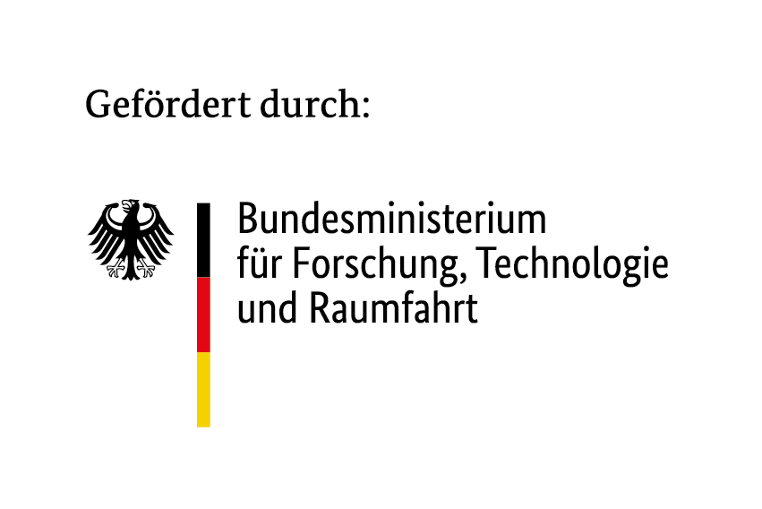

<div style="background-color: #ffffff; color: #000000; padding: 10px;">

<h1> Richtlinien-Assistent MLEUV
</div>

KI-gestütztes Werkzeug zur Erstellung von Förderrichtlinien nach § 44 LHO. Pilotprojekt mit
dem Ministerium für Landwirtschaft, Umwelt und Verbraucherschutz Brandenburg.

Das Werkzeug führt durch die elf Bausteine der Musterstruktur, schlägt je Feld einen Wert vor,
sagt dazu, woher der Wert stammt, und formuliert am Ende den Richtlinientext aus. Es
entscheidet nichts: jeder Vorschlag wird bestätigt, geändert oder verworfen.

## Features

- **Geführte Erhebung.** Ein Chat fragt die Eckpunkte in fester Reihenfolge ab und ordnet
  freie Antworten den Formularfeldern zu.
- **Belegte Vorschläge.** Zu jedem Wert werden Herkunft, Musterbaustein und Fundstelle
  ausgewiesen; das Zitat wird zeichengenau gegen das Quelldokument geprüft. Was die Eingabe
  nicht deckt, wird `[Unklar]` genannt statt geraten.
- **Prüfung nach Regelwerk.** Schwellenwerte und Bestimmungen aus dem Prozessmodell laufen
  deterministisch mit — ohne Modell und damit ohne Streuung.
- **Zwei Arbeitsergebnisse.** Die Richtlinie und, getrennt davon, der Prüfvermerk mit den
  begründungspflichtigen Abweichungen.
- **Lokaler Betrieb.** Suchindex und Dokumente bleiben im Haus; das Sprachmodell läuft auf
  dem Cluster des AI Service Centre.

Bedienung Schritt für Schritt: **[handbuch.md](handbuch.md)**. Aufbau, Dienste und
Datenflüsse: **[infrastruktur.md](infrastruktur.md)**.

## Setup and Installation

### Prerequisites

- Docker und Docker Compose
- Python 3.11+ und Node 20
- Zugang zum LiteLLM-Endpunkt des AI Service Centre

### Quick Start

Quelldokumente und alles, was ihren Wortlaut trägt, sind von git ausgenommen — zwei Schritte
unten müssen deshalb von Hand ergänzt werden.

```bash
# 1 Einrichten
cd 02_backend && docker compose up -d
python -m venv .venv && source .venv/bin/activate && pip install -r requirements.txt
cp .env.example .env
```

**Jetzt von Hand:** in `.env` Endpunkt, Schlüssel und Modelle eintragen, und die
Quelldokumente des MLEUV nach `02_backend/data` legen. Ohne sie hat der Index nichts zu lesen.

```bash
# 2 Einmalige Läufe
python src/ingest.py                                       # Dokumente in den Index;
                                                           # beim ersten Mal lädt docling Modelle
python src/musterbausteine.py --pdf "<Musterrichtlinie>"   # Satzrahmen aus der Vorlage

# 3 Vorschlagsdienst
LITELLM_LOCAL_MODEL_COST_MAP=True .venv/bin/uvicorn api:app --port 8000 --app-dir src

# 4 Oberfläche, eigene Shell
cd 01_frontend && npm install && npm run dev
```

- Frontend: <http://localhost:5173>
- Node-API: <http://localhost:4317> · Vorschlagsdienst: <http://localhost:8000>

Fehlt Schritt 2b, läuft alles weiter — die Vorschläge verlieren nur ihren Satzrahmen und
werden schlechter, ohne sichtbaren Hinweis. `curl -s http://127.0.0.1:8000/gesundheit` meldet
das als `"vorlage_eingelesen": false`.

## Limitations

- **Kein Ersatz für fachliche und rechtliche Prüfung.** Das Werkzeug erstellt einen Vorschlag
  zur Überarbeitung, keine fertige Richtlinie.
- **Einzelnutzer, keine Anmeldung.** Alles läuft lokal auf `127.0.0.1`; gleichzeitiges
  Arbeiten mehrerer Personen ist nicht vorgesehen.
- **Die Redaktionsansicht (Stufe 2) ist ein Mockup** mit Demo-Daten. Der echte Textweg ist die
  Seite „Richtlinientext".
- **Nicht für alle Bausteine gemessen**, und nicht gemessen ist die inhaltliche Deckung einer
  Aussage durch ihre Fundstelle.
- **Vertrauliche Dokumente** verlassen das Haus nicht; ihre Titel und Inhalte stehen in keiner
  Datei dieses Repositoriums.

## References

- [AI Service Centre Berlin-Brandenburg](https://hpi.de/kisz)

## Author

- [Jill Barvencik](https://hpi.de/kisz), AI Service Centre Berlin-Brandenburg

## License

Siehe [LICENSE](LICENSE). Übernommene Teile des Spark-Vorprojekts stehen unter EUPL-1.2 und
werden mit Namensnennung nachgenutzt.

---

## Acknowledgements


The [AI Service Centre Berlin Brandenburg](http://hpi.de/kisz) is funded by the [Federal Ministry of Research, Technology and Space](https://www.bmbf.de/) under the funding code 16IS22092.
